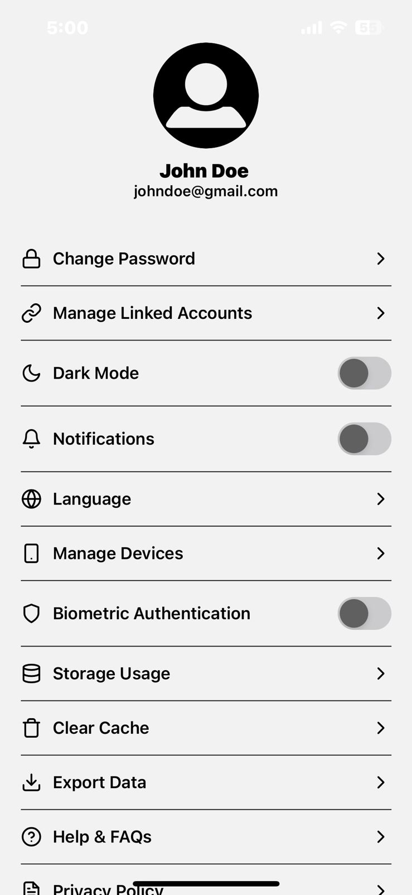
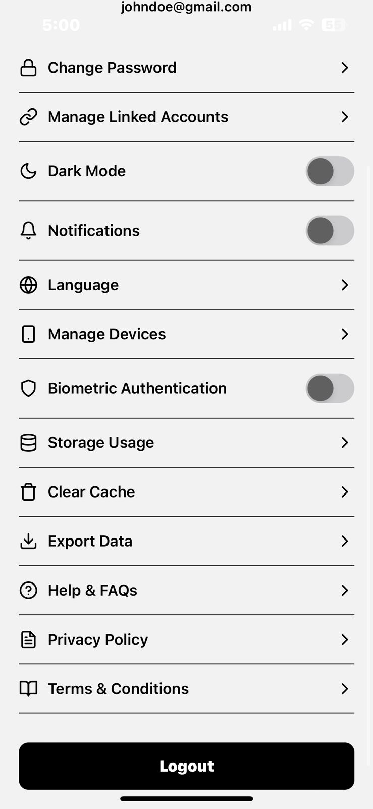

# React Native Settings Screen

A simple and elegant settings screen built using React Native. This screen includes user profile information and various settings options such as dark mode toggle, notifications, biometric authentication, and more.

## Features
- Displays user profile with an image, name, and email.
- Various settings options with icons.
- Toggle options for Dark Mode, Notifications, and Biometric Authentication.
- Logout button for user account management.
- Fully responsive layout.

## Technologies Used
- React Native
- Expo
- React Native Feather Icons
- React Native Switch

  
## How it looks!



## Installation and Setup

### Prerequisites
Ensure you have Node.js and Expo CLI installed:
```sh
node -v
npm install -g expo-cli
```

### 1️⃣ Clone the Repository
```sh
git clone <repository_url>
cd <repository_folder>
```

### 2️⃣ Install Dependencies
```sh
npm install
```

### 3️⃣ Run the Application
```sh
npx expo start
```
Select the desired emulator or scan the QR code using the Expo Go app.

## Components
### `SettingsScreen.js`
This file defines the main settings screen with:
- User profile section.
- List of settings options.
- Logout button.

### `SettingItem.js`
Reusable component for each setting item with an icon and optional toggle switch.


